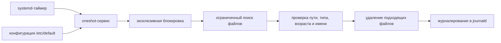

# Wazuh Alerts Retention

Безопасное и контролируемое удаление ротированных файлов алертов Wazuh с помощью Bash-скрипта и защищённого systemd-таймера.

Wazuh ротирует и сжимает журналы алертов в `/var/ossec/logs/alerts/YYYY/Mon/`, однако в локальной самостоятельной установке эти файлы сохраняются, пока администратор не удалит или не перенесёт их. Проект удаляет только выбранные ротированные файлы после настраиваемого срока хранения.

> Разработано и проверено на Debian 12 с Wazuh 4.14.2. На других версиях перед включением удаления необходимо проверить результат через `--dry-run`.

[English README](README.md)

## Какие файлы удаляются

Под удаление попадают только обычные файлы следующих форматов:

```text
/var/ossec/logs/alerts/YYYY/Mon/ossec-alerts-DD.log.gz
/var/ossec/logs/alerts/YYYY/Mon/ossec-alerts-DD.json.gz
/var/ossec/logs/alerts/YYYY/Mon/ossec-alerts-DD.log.sum
/var/ossec/logs/alerts/YYYY/Mon/ossec-alerts-DD.json.sum
/var/ossec/logs/alerts/YYYY/Mon/ossec-alerts-DD-NNN.log.gz
/var/ossec/logs/alerts/YYYY/Mon/ossec-alerts-DD-NNN.json.gz
/var/ossec/logs/alerts/YYYY/Mon/ossec-alerts-DD-NNN.log.sum
/var/ossec/logs/alerts/YYYY/Mon/ossec-alerts-DD-NNN.json.sum
```

По умолчанию срок хранения составляет **7 полных суток**, рассчитанных по времени изменения файла.

Не удаляются:

- текущие `/var/ossec/logs/alerts/alerts.log` и `alerts.json`;
- несжатые `.log` и `.json`;
- каталоги, символические ссылки, файлы с неожиданными именами или структурой пути;
- файлы на другой файловой системе, смонтированной внутри каталога алертов.

## Возможности

- явные режимы `--dry-run` и `--delete`;
- неблокирующая блокировка от одновременного ручного и планового запуска;
- строгая проверка года, месяца, имени, глубины, типа и возраста файла;
- безопасная обработка имён через NUL-разделитель;
- ежедневный systemd-таймер с `Persistent=true`;
- журналирование результата в journald;
- защищённый oneshot-сервис с правом записи только в каталог алертов;
- безопасный установщик: по умолчанию он выполняет только предварительную проверку и не меняет текущее состояние таймера;
- функциональные тесты и автоматическая проверка через GitHub Actions.

## Схема работы



Таймер запускает oneshot-сервис. Сервис загружает срок хранения, вызывает скрипт с параметром `--delete` и записывает полный результат в journald. Ручные режимы `--dry-run` и `--delete` используют ту же блокировку и те же правила отбора.

## Механизмы безопасности

| Механизм | Результат |
|---|---|
| Фиксированная глубина | Проверяется только структура `alerts/год/месяц/файл` |
| Точное регулярное выражение пути | Допускаются только известные имена ротированных алертов Wazuh |
| `-type f` | Исключаются каталоги и символические ссылки |
| `-xdev` | Поиск не переходит на вложенные смонтированные файловые системы |
| Ограничение по времени изменения | Удаляются только файлы старше заданного срока |
| Неблокирующий `flock` | Исключаются одновременные плановые и ручные запуски |
| Защищённый systemd-сервис | Ограничиваются доступные для записи пути и лишние привилегии |
| Установщик с предварительной проверкой | До удаления показывается точный набор подходящих файлов |

## Структура репозитория

```text
.
├── bin/
│   └── wazuh-alerts-retention
├── config/
│   └── wazuh-alerts-retention
├── systemd/
│   ├── wazuh-alerts-retention.service
│   └── wazuh-alerts-retention.timer
├── tests/
│   └── test-retention.sh
├── .github/
│   ├── dependabot.yml
│   └── workflows/ci.yml
├── .editorconfig
├── CHANGELOG.md
├── CONTRIBUTING.md
├── LICENSE
├── Makefile
├── install.sh
├── uninstall.sh
├── README.md
├── README_RU.md
├── SECURITY.md
└── VERSION
```

## Требования

- локальный Wazuh Manager с каталогом `/var/ossec/logs/alerts`;
- systemd;
- Bash и GNU `find`, `stat`, `mktemp`, `rm` и `flock`;
- права `root` для установки и автоматического удаления.

## Установка

Склонируй или скачай репозиторий и перейди в его каталог.

### Безопасная установка

Команда устанавливает и проверяет файлы, затем выполняет только предварительный просмотр. Очистка не запускается, а текущее состояние таймера не изменяется.

```bash
sudo ./install.sh
```

После проверки строк `WOULD_DELETE` включи таймер:

```bash
sudo systemctl enable --now wazuh-alerts-retention.timer
```

Первую реальную очистку можно выполнить вручную:

```bash
sudo systemctl start wazuh-alerts-retention.service
```

### Полная установка

Команда устанавливает проект, показывает предварительный список, выполняет одну реальную очистку и включает таймер:

```bash
sudo ./install.sh --retention-days 7 --run-now --enable
```

Установщик создаёт резервные копии существующих исполняемого файла и systemd-модулей с суффиксом `.bak.YYYYMMDD-HHMMSS`. Существующий `/etc/default/wazuh-alerts-retention` сохраняется, если не передан параметр `--retention-days`.

### Обновление существующей установки

Получи новую версию репозитория и выполни:

```bash
sudo ./install.sh
```

Установщик заменит исполняемый файл и systemd-модули, сохранит текущую конфигурацию, перезапустит уже активный таймер для загрузки обновлённого модуля и выполнит только предварительную проверку. Дополнительная очистка не запускается без параметра `--run-now`.

## Настройка срока хранения

Параметр хранится в файле:

```text
/etc/default/wazuh-alerts-retention
```

Настройка по умолчанию:

```bash
RETENTION_DAYS=7
```

Допустимый диапазон — от `1` до `3650`. После изменения перезапуск сервиса не требуется: oneshot-сервис заново читает конфигурацию при каждом запуске.

## Расписание

По умолчанию таймер запускается ежедневно в **03:15 по локальному времени сервера**, после обычной полуночной ротации:

```ini
OnCalendar=*-*-* 03:15:00
Persistent=true
```

Чтобы изменить время без редактирования установленного модуля:

```bash
sudo systemctl edit wazuh-alerts-retention.timer
```

Пример переопределения:

```ini
[Timer]
OnCalendar=
OnCalendar=*-*-* 04:30:00
```

Применение:

```bash
sudo systemctl daemon-reload
sudo systemctl restart wazuh-alerts-retention.timer
```

## Ручной запуск

Предварительный просмотр:

```bash
sudo /usr/local/sbin/wazuh-alerts-retention --dry-run
```

Немедленное удаление подходящих файлов:

```bash
sudo /usr/local/sbin/wazuh-alerts-retention --delete
```

Проверка другого срока без изменения установленной конфигурации:

```bash
sudo RETENTION_DAYS=14 /usr/local/sbin/wazuh-alerts-retention --dry-run
```

## Проверка работы и журналы

Состояние таймера:

```bash
systemctl status wazuh-alerts-retention.timer --no-pager
systemctl list-timers --all --no-pager wazuh-alerts-retention.timer
```

Последний результат очистки:

```bash
systemctl status wazuh-alerts-retention.service --no-pager
journalctl -u wazuh-alerts-retention.service -n 100 --no-pager
```

Размер каталога:

```bash
du -sh /var/ossec/logs/alerts
```

## Тестирование

Все локальные проверки синтаксиса, ShellCheck при его наличии и функциональные тесты:

```bash
make check
```

Только функциональные тесты в изолированном временном каталоге:

```bash
bash tests/test-retention.sh
```

Дополнительная статическая проверка:

```bash
shellcheck bin/wazuh-alerts-retention install.sh uninstall.sh tests/test-retention.sh
```

После установки можно проверить установленные systemd-модули и путь к исполняемому файлу:

```bash
sudo systemd-analyze verify \
  /etc/systemd/system/wazuh-alerts-retention.service \
  /etc/systemd/system/wazuh-alerts-retention.timer
```

## Коды завершения

| Код | Значение |
|---:|---|
| `0` | Успешное выполнение |
| `1` | Ошибка выполнения или хотя бы одна ошибка удаления |
| `2` | Некорректные аргументы или конфигурация |
| `75` | Другой экземпляр уже удерживает блокировку |

## Удаление

Удалить исполняемый файл и systemd-модули, сохранив конфигурацию:

```bash
sudo ./uninstall.sh
```

Удалить также конфигурацию:

```bash
sudo ./uninstall.sh --purge
```

Удаление проекта не затрагивает журналы Wazuh и резервные копии `.bak.*`, созданные установщиком.

## Эксплуатационные последствия

Удаление локальных ротированных файлов не удаляет документы, уже находящиеся в Wazuh Indexer. При этом исчезают соответствующие локальные сжатые копии, поэтому сокращается доступное окно для ручного восстановления, повторной загрузки, расследования или внешнего резервного копирования. Срок хранения нужно выбирать с учётом требований реагирования на инциденты и нормативных требований.

Пустые каталоги годов и месяцев намеренно не удаляются.

## Официальная документация

- [Журналирование и ротация Wazuh](https://documentation.wazuh.com/current/user-manual/manager/event-logging.html)
- [Схема сбора и обработки журналов Wazuh](https://documentation.wazuh.com/current/user-manual/capabilities/log-data-collection/how-it-works.html)

## Лицензия

MIT. См. [LICENSE](LICENSE).
